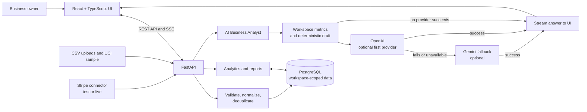

# Clearview BI

**One clear view. Better next moves.**

Clearview BI is a **tool-using AI business analyst agent** for startups and small businesses. A business owner can ask a question in natural language; the agent scopes the request to the selected company, period and data source, runs the relevant analytics, and returns an evidence-grounded explanation or next-step recommendation. It can also prepare an inventory reorder draft for a person to review. It brings imported sales, customer, product and inventory data into one workspace so owners can move from scattered records to a clear, reviewable decision.

> **Demo data:** The included CSVs and the sample figures in screenshots and the presentation are synthetic. They are for product demonstration only and are not customer results or financial guidance.

## Hackathon submission

- **Impact slides:** [Clearview BI Hackathon Impact Deck](presentation-output/Clearview-BI-Hackathon-Impact-Deck-v2.pptx). The deck labels demo data and separates demonstrated functionality from pilot outcomes that have not yet been measured.
- **Demo video:** Submit separately as a 2–3 minute walkthrough.

## At a glance

- **Bring data together:** upload order, customer and product CSVs; connect the Stripe test-mode connector when a server-side key is configured.
- **Try historical public records:** import a 500-invoice UCI Online Retail sample with customer and product rows to explore real transaction patterns; it is historical dataset testing, not a Clearview customer-impact claim.
- **See business performance:** explore revenue and order trends, period comparisons, products, categories, sales sources, customer activity, alerts and inventory risk.
- **Ask the analyst:** get streamed answers grounded in workspace metrics, with the period and source scope shown and limitations called out when evidence is incomplete.
- **Use AI providers optionally:** OpenAI is tried first, Gemini is the fallback, and the built-in deterministic analyst remains available if providers are not configured or fail.
- **Move from alert to action:** review RFM customer segments and prepare an inventory reorder draft for a manager to review. Drafting never places an order.
- **Share a company workspace:** invite managers or viewers, keep each company's records scoped to its workspace, and review account and ingestion activity.
- **Export a report:** download a multi-sheet Excel workbook or use the print/PDF report view.
- **Normalize supported currencies:** revenue is reported in USD using daily reference rates when available. Orders with unsupported or unavailable rates are reported separately and excluded from USD totals.

## Why Clearview BI is an AI agent

Clearview is more than a chat box attached to a dashboard: the agent connects a natural-language request to company-scoped business data and analytic capabilities, then returns a response with its evidence and limits. Its workflow is:

1. **Understand the request.** The owner asks about sales, products, customers, cancellations, inventory or a recommended action, with a selected reporting period and optional source filter.
2. **Use business-data tools.** The backend retrieves workspace-scoped records and invokes deterministic analytics for the relevant KPIs, comparisons, product/customer breakdowns, alerts or diagnosis. The calculations—not the language model—are the source of reported figures.
3. **Reason over the evidence.** When configured, OpenAI is the primary model and Gemini is tried if OpenAI is unavailable or fails. The model explains the computed context; if neither provider is configured, the built-in analyst can still return deterministic answers.
4. **Return a reviewable result.** Answers stream to the UI and identify the period, source scope and available evidence. When the data cannot establish a cause or support a claim, the analyst should say so instead of inventing a number.
5. **Prepare a bounded action.** For stock risk, the agent can calculate a suggested reorder quantity and prepare a draft. A manager reviews it; Clearview does not place orders or change business records on the user's behalf.

The agent's tools include natural-language analytics, anomaly diagnosis, prioritized recommendations, customer segmentation and inventory reorder drafting. Company data is workspace-scoped. Direct SQL execution is disabled for company workspaces, and no model provider is required for the basic deterministic analyst. This is a bounded decision-support agent with human review—not an autonomous operator.

### Agent demo in one question

After importing the sample business data, ask **“Why is our cancellation rate high?”** Clearview reports the observed rate and affected order count for the selected period, checks what evidence is available, and distinguishes observed facts from possible causes. Then open the stock-risk view and prepare a reorder draft to see the human-reviewed action flow. The included demo records are synthetic; use the [demo runbook](DEMO_RUNBOOK.md) to reproduce the workflow.

## Business case

### Customer and problem

Clearview BI is designed for small, multi-channel retailers and other SMEs that manage sales and customer activity across several tools. Owners often export orders, payments, customer lists and product stock into separate spreadsheets before they can answer basic operating questions. That manual work delays reporting and makes it easier to miss a rising cancellation rate, a low-stock product or a change in repeat buying.

### Value proposition

Clearview gives the owner one company workspace for imported business records, a dashboard for sales and inventory signals, and an analyst that answers questions from the available data. It can explain what a metric shows, surface when the records do not establish a cause, and prepare a reorder suggestion for a manager to review. The goal is to help a small team spend less time assembling reports and respond sooner to issues that could affect sales or stock availability.

### How a pilot should measure impact

No real SME pilot has been completed, so this project does not claim measured time savings, cost reductions or revenue gains. A pilot should record a baseline, use the same business and reporting period after onboarding, and compare:

- **Time saved:** minutes spent preparing a weekly sales and stock report.
- **Operational response:** time from an alert to a reviewed action, plus stockout frequency and days of cover.
- **Revenue outcomes:** changes in cancellation recovery and repeat purchases, measured against the business's own baseline and with other causes considered.

The bundled fictional records demonstrate the product workflow. The UCI Online Retail sample demonstrates ingestion and historical transaction analysis; neither represents a Clearview customer or validates business impact.

### Business model hypothesis

A potential model is a low-cost SaaS subscription per company workspace, with plans based on connected data sources or transaction volume. This pricing and willingness to pay have not been validated. A real SME pilot should test whether the time saved and decisions improved justify the proposed subscription.

## Product workflow

1. **Create a company account.** The first account on a fresh database claims the existing demo workspace; subsequent company signups receive separate workspaces.
2. **Import or connect data.** Upload CSVs from **Data Sources**, or configure a Stripe test key on the backend and sync a registered Stripe source. Review each pipeline run's result and timestamp.
3. **Explore the dashboard.** Select a period and source, review KPIs and alerts, then use the customer segments, product and inventory views to identify a question.
4. **Ask and act carefully.** Ask the AI Business Analyst for a measured explanation or recommendation. Use the evidence and caveats to judge the answer. A reorder draft is for human review; it does not create a purchase order.
5. **Share and report.** Invite a teammate with manager or viewer access, inspect activity, and export the current report.

## Features

### Data ingestion and quality

The pipeline validates and normalizes incoming records, stores source and raw payload context, skips duplicates, and records invalid rows and run counts. Order, customer and product imports are supported. Product files can include `stock_quantity` and `reorder_point` for stock-risk estimates.

### Analytics and inventory

Analytics include revenue, order count, average order value, active customers, prior-period comparisons, time trends, top products, sales channels, category breakdowns, customer activity and business alerts. Revenue conversions use refreshed daily reference rates with bundled rates as an offline fallback; this is not historical transaction-date FX accounting. Unsupported currencies are excluded from USD totals and surfaced in the UI/context. Inventory cover is estimated from linked recent sales and does not model supplier lead time unless a user supplies it when preparing a reorder draft.

### AI Business Analyst

The analyst first builds a deterministic answer from workspace-scoped metrics. If API keys are configured, it asks OpenAI to refine the answer and falls back to Gemini if OpenAI fails. If neither provider is available, the deterministic answer is used. The streaming endpoint sends answers over Server-Sent Events. The model receives the analytic context and draft answer; never place secrets in prompts or frontend code.

The analyst supports business questions, recommendations, anomaly diagnosis and inventory reorder drafts. It should state when records do not support an answer. Recommendations are suggestions to evaluate, not guaranteed business outcomes. Direct SQL execution is disabled for company workspaces.

### Company accounts and activity

Each account belongs to a company workspace. Managers can invite teammates and manage roles; viewers can read analytics but cannot import data, change sources or start syncs. Invitations last seven days. Configure SMTP to send invite email; without SMTP, the UI provides a secure invitation link to share. The Activity page combines ingestion history with account events such as sign-ins, invitations, role changes and member removal.

### Exports

- **Excel:** an executive summary plus sales trends, top products, customer segments and AI recommendations where available.
- **Print/PDF:** an executive report view suitable for browser printing or saving as PDF.
- **CSV:** time-series revenue and order data.

## Integrations and limits

- **CSV:** supported for orders, customers and products.
- **Stripe:** test/live API connector code is available; configure a restricted key on the backend. The connector imports only the records available to the account and permissions. A zero-record run can still validate access; check the run details and account data.
- **Other connector modules:** the repository includes connector foundations and optional integrations, but they are not all active, production-ready integrations. Do not assume Shopify, social media or customer-support systems are connected.
- **Cross-platform identity:** customer records are not automatically deduplicated across different platforms.
- **Currency:** only currencies with a known rate can be converted; the fallback reference rates are not a substitute for accounting FX.
- **Inventory:** estimates depend on imported stock and linked sales, and do not account for reserved units, supplier lead time or safety stock unless the user factors lead time into a draft.

This is a hackathon/MVP build. Before using live business data, review security, deployment configuration, access controls, backups, retention, monitoring, API-provider costs and financial reporting assumptions.

## Architecture

- **Frontend:** React, TypeScript and Vite single-page application (`frontend/`).
- **API:** FastAPI application with SQLAlchemy models and workspace-scoped analytics (`app/`).
- **Pipeline:** CSV and connector records pass through validation, normalization, deduplication and persistence (`app/pipeline/`, `app/services/`).
- **Storage:** PostgreSQL in Docker Compose; SQLite can be used for local development with `DATABASE_URL`.
- **Optional services:** mock API, Stripe, HubSpot, OpenAI, Gemini and SMTP, enabled through server-side environment settings.



Each authenticated request is scoped to the user's company workspace. Imported data and connector syncs share the same ingestion pipeline; the analyst uses workspace metrics to ground answers before optional model refinement. Answers stream back to the browser, while deterministic analysis remains available if external AI providers are unavailable.

See [Database and API reference](DATABASE_CONTRACT.md), [Demo runbook](DEMO_RUNBOOK.md), [demo and public data notes](data/README.md) and [frontend development notes](frontend/README.md).

## Requirements

- Python 3.11 or newer
- Node.js 22+ and npm (see the checked-in frontend lockfile)
- Docker Desktop with Compose, if using the container workflow

## Five-minute judge demo

The isolated judge demo seeds the fictional workspace, waits for the API health check, and prints the local URL. It requires Docker Desktop; no API keys or shared reviewer password are needed. On a fresh database, create an account to claim the seeded workspace.

**Windows PowerShell:**

```powershell
.\scripts\judge_demo.ps1
```

**macOS or Linux:**

```bash
bash scripts/judge_demo.sh
```

Open [http://127.0.0.1:5175](http://127.0.0.1:5175) and create a company account. The built-in analyst works without AI keys; OpenAI and Gemini are optional. Stop the demo and keep its database volume with `.\scripts\judge_demo.ps1 -Stop` on Windows or `bash scripts/judge_demo.sh --stop` on macOS/Linux. The first image build can take longer than five minutes depending on network and machine speed; once images are cached, setup is a single command.

## Run locally on Windows

### 1. Start the API

From the repository root in PowerShell:

```powershell
python -m venv .venv
.\.venv\Scripts\Activate.ps1
python -m pip install -r requirements.txt
$env:DATABASE_URL = "sqlite:///./local_runtime.db"
$env:SCHEDULER_INTERVAL_MINUTES = "0"
python -m uvicorn app.main:app --host 127.0.0.1 --port 8000 --reload
```

Open [http://localhost:8000/docs](http://localhost:8000/docs) for the API reference. Keep the API terminal running.

### 2. Start the frontend

In a second PowerShell terminal:

```powershell
cd frontend
$env:VITE_PROXY_TARGET = "http://127.0.0.1:8000"
npm ci
npm run dev
```

Open [http://localhost:5173](http://localhost:5173). Vite proxies API requests to `http://127.0.0.1:8003` by default; the command above points it at the locally started API on port `8000`.

### Optional configuration

Copy `.env.example` to `.env` and set only the values you need. The backend loads `.env`; the frontend must never receive secret keys.

| Variable | Purpose |
| --- | --- |
| `DATABASE_URL` | SQLAlchemy database connection |
| `SCHEDULER_INTERVAL_MINUTES` | Automatic sync interval; use `0` to disable |
| `STRIPE_SECRET_KEY` | Server-side Stripe connector credential |
| `OPENAI_API_KEY` | Primary AI answer provider |
| `GEMINI_API_KEY` | Fallback AI answer provider |
| `HUBSPOT_ACCESS_TOKEN` | Optional HubSpot connector credential |
| `FRONTEND_BASE_URL` | Base URL used to construct invitation links |
| `SMTP_HOST`, `SMTP_PORT`, `SMTP_USERNAME`, `SMTP_PASSWORD`, `SMTP_FROM_EMAIL` | Optional invitation email delivery |
| `MOCK_API_URL` | Mock API connector endpoint |

Never commit `.env`, paste secrets into the frontend, or use unrestricted keys. If a key has been shared publicly or in a chat, revoke it and create a replacement.

## Run with Docker Compose

With Docker Desktop running, from the repository root:

```powershell
docker compose up --build
```

Compose starts PostgreSQL, the mock API, the FastAPI backend and the Vite frontend. Open [http://localhost:5173](http://localhost:5173). To stop the stack, run `docker compose down`; the named PostgreSQL volume persists unless explicitly removed.

## Sample data

The `data/` folder contains fictional sales, customer and product examples. Follow the [demo data guide](data/README.md) to import them. Keep demo data in a separate database from any business records.

## Developer checks

```powershell
cd frontend
npm run lint
npm run build
cd ..
$env:DATABASE_URL = "sqlite:///./test_runtime.db"
$env:SCHEDULER_INTERVAL_MINUTES = "0"
python -m pytest tests -q
```

The backend test suite includes integration tests that bind to localhost. Use a disposable database for development checks.
